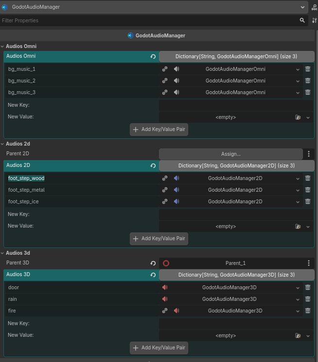
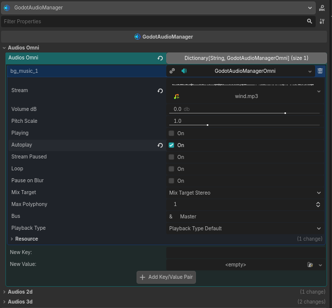
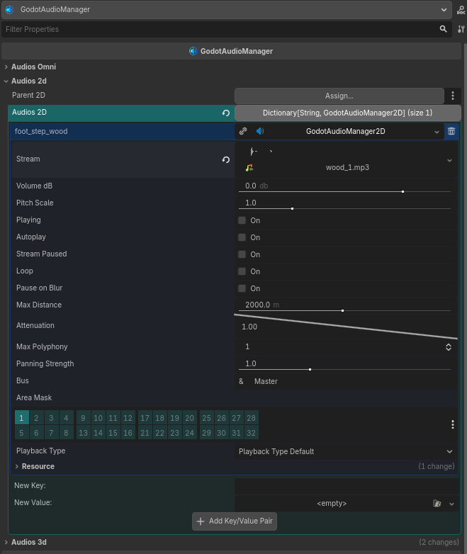
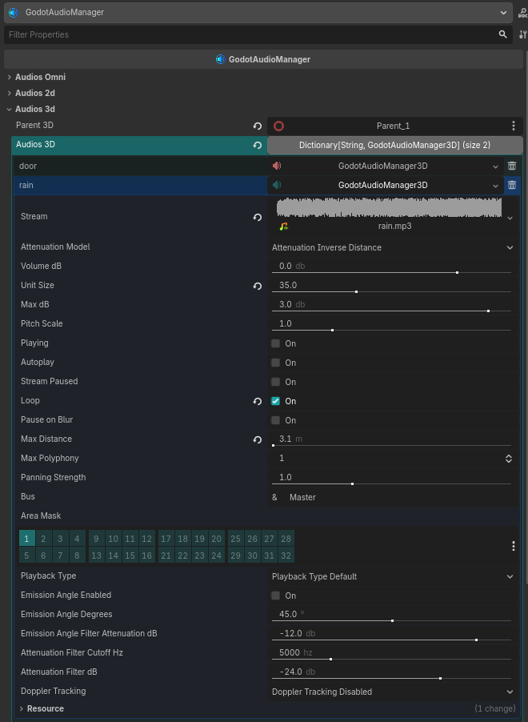

# Godot Audio Manager Plugin

## GodotAudioManager

The `GodotAudioManager` is a comprehensive audio management system that provides centralized control over multiple audio sources in Godot. It allows you to manage omnidirectional, 2D, and 3D audio streams from a single node, with additional features like automatic pause on window blur and tab switching.

### Properties

| Property      | Type                                      | Description                                   |
| ------------- | ----------------------------------------- | --------------------------------------------- |
| `audios_omni` | Dictionary[String, GodotAudioManagerOmni] | Dictionary of omnidirectional audio resources |
| `parent_2d`   | Node2D                                    | Parent node for 2D audio players              |
| `audios_2d`   | Dictionary[String, GodotAudioManager2D]   | Dictionary of 2D audio resources              |
| `parent_3d`   | Node3D                                    | Parent node for 3D audio players              |
| `audios_3d`   | Dictionary[String, GodotAudioManager3D]   | Dictionary of 3D audio resources              |

### Methods

| Method                       | Parameters                                     | Return Type           | Description                                               |
| ---------------------------- | ---------------------------------------------- | --------------------- | --------------------------------------------------------- |
| `play_omni`                  | audio_name: String, from_position: float = 0.0 | void                  | Plays an omnidirectional audio                            |
| `stop_omni`                  | audio_name: String                             | void                  | Stops an omnidirectional audio                            |
| `pause_omni`                 | audio_name: String                             | void                  | Pauses an omnidirectional audio                           |
| `unpause_omni`               | audio_name: String                             | void                  | Resumes a paused omnidirectional audio                    |
| `is_playing_omni`            | audio_name: String                             | bool                  | Checks if an omnidirectional audio is playing             |
| `is_paused_omni`             | audio_name: String                             | bool                  | Checks if an omnidirectional audio is paused              |
| `seek_omni`                  | audio_name: String, position: float            | void                  | Seeks to a specific position in an omnidirectional audio  |
| `get_playback_position_omni` | audio_name: String                             | float                 | Returns the playback position of an omnidirectional audio |
| `get_stream_playback_omni`   | audio_name: String                             | AudioStreamPlayback   | Returns the stream playback of an omnidirectional audio   |
| `has_stream_playback_omni`   | audio_name: String                             | bool                  | Checks if an omnidirectional audio has stream playback    |
| `get_audio_omni`             | audio_name: String                             | GodotAudioManagerOmni | Gets an omnidirectional audio resource                    |
| `set_loop_omni`              | audio_name: String, value: bool                | void                  | Sets loop for an omnidirectional audio                    |
| `play_2d`                    | audio_name: String, from_position: float = 0.0 | void                  | Plays a 2D audio                                          |
| `stop_2d`                    | audio_name: String                             | void                  | Stops a 2D audio                                          |
| `pause_2d`                   | audio_name: String                             | void                  | Pauses a 2D audio                                         |
| `unpause_2d`                 | audio_name: String                             | void                  | Resumes a paused 2D audio                                 |
| `is_playing_2d`              | audio_name: String                             | bool                  | Checks if a 2D audio is playing                           |
| `is_paused_2d`               | audio_name: String                             | bool                  | Checks if a 2D audio is paused                            |
| `seek_2d`                    | audio_name: String, position: float            | void                  | Seeks to a specific position in a 2D audio                |
| `get_playback_position_2d`   | audio_name: String                             | float                 | Returns the playback position of a 2D audio               |
| `get_stream_playback_2d`     | audio_name: String                             | AudioStreamPlayback   | Returns the stream playback of a 2D audio                 |
| `has_stream_playback_2d`     | audio_name: String                             | bool                  | Checks if a 2D audio has stream playback                  |
| `get_audio_2d`               | audio_name: String                             | GodotAudioManager2D   | Gets a 2D audio resource                                  |
| `set_loop_2d`                | audio_name: String, value: bool                | void                  | Sets loop for a 2D audio                                  |
| `play_3d`                    | audio_name: String, from_position: float = 0.0 | void                  | Plays a 3D audio                                          |
| `stop_3d`                    | audio_name: String                             | void                  | Stops a 3D audio                                          |
| `pause_3d`                   | audio_name: String                             | void                  | Pauses a 3D audio                                         |
| `unpause_3d`                 | audio_name: String                             | void                  | Resumes a paused 3D audio                                 |
| `is_playing_3d`              | audio_name: String                             | bool                  | Checks if a 3D audio is playing                           |
| `is_paused_3d`               | audio_name: String                             | bool                  | Checks if a 3D audio is paused                            |
| `seek_3d`                    | audio_name: String, position: float            | void                  | Seeks to a specific position in a 3D audio                |
| `get_playback_position_3d`   | audio_name: String                             | float                 | Returns the playback position of a 3D audio               |
| `get_stream_playback_3d`     | audio_name: String                             | AudioStreamPlayback   | Returns the stream playback of a 3D audio                 |
| `has_stream_playback_3d`     | audio_name: String                             | bool                  | Checks if a 3D audio has stream playback                  |
| `get_audio_3d`               | audio_name: String                             | GodotAudioManager3D   | Gets a 3D audio resource                                  |
| `set_loop_3d`                | audio_name: String, value: bool                | void                  | Sets loop for a 3D audio                                  |

### Signals

| Signal          | Parameters | Description                             |
| --------------- | ---------- | --------------------------------------- |
| `finished_omni` | audio_name | Emitted when omnidirectional audio ends |
| `finished_2d`   | audio_name | Emitted when 2D audio ends              |
| `finished_3d`   | audio_name | Emitted when 3D audio ends              |

---

## GodotAudioManagerOmni

The `GodotAudioManagerOmni` class represents an omnidirectional audio resource that replaces Godot's native `AudioStreamPlayer` node. It provides full control over audio properties and playback behavior.

### Properties

| Property        | Type                        | Description                                                        |
| --------------- | --------------------------- | ------------------------------------------------------------------ |
| `stream`        | AudioStream                 | The AudioStream resource to be played                              |
| `volume_db`     | float                       | Volume of sound in decibels                                        |
| `pitch_scale`   | float                       | Audio pitch and tempo multiplier                                   |
| `playing`       | bool                        | Whether the audio is currently playing                             |
| `autoplay`      | bool                        | Whether the audio should play automatically when entering the tree |
| `stream_paused` | bool                        | Whether the audio is paused                                        |
| `loop`          | bool                        | Whether the audio should loop                                      |
| `pause_on_blur` | bool                        | Whether to pause audio when window loses focus                     |
| `mix_target`    | AudioStreamPlayer.MixTarget | Mix target channels                                                |
| `max_polyphony` | int                         | Maximum number of sounds that can play simultaneously              |
| `bus`           | StringName                  | Target audio bus name                                              |
| `playback_type` | AudioServer.PlaybackType    | Playback type of the stream player                                 |

---

## GodotAudioManager2D

The `GodotAudioManager2D` class represents a 2D audio resource that replaces Godot's native `AudioStreamPlayer2D` node. It provides full control over 2D audio properties and playback behavior with spatial audio features.

### Properties

| Property           | Type                     | Description                                                        |
| ------------------ | ------------------------ | ------------------------------------------------------------------ |
| `stream`           | AudioStream              | The AudioStream resource to be played                              |
| `volume_db`        | float                    | Volume of sound in decibels                                        |
| `pitch_scale`      | float                    | Audio pitch and tempo multiplier                                   |
| `playing`          | bool                     | Whether the audio is currently playing                             |
| `autoplay`         | bool                     | Whether the audio should play automatically when entering the tree |
| `stream_paused`    | bool                     | Whether the audio is paused                                        |
| `loop`             | bool                     | Whether the audio should loop                                      |
| `pause_on_blur`    | bool                     | Whether to pause audio when window loses focus                     |
| `max_distance`     | float                    | Distance beyond which the sound can no longer be heard             |
| `attenuation`      | float                    | Volume attenuation over distance                                   |
| `max_polyphony`    | int                      | Maximum number of sounds that can play simultaneously              |
| `panning_strength` | float                    | Panning strength factor                                            |
| `bus`              | StringName               | Target audio bus name                                              |
| `area_mask`        | int                      | Area2D layers that affect the sound                                |
| `playback_type`    | AudioServer.PlaybackType | Playback type of the stream player                                 |

---

## GodotAudioManager3D

The `GodotAudioManager3D` class represents a 3D audio resource that replaces Godot's native `AudioStreamPlayer3D` node. It provides full control over 3D audio properties and playback behavior with advanced spatial audio features.

### Properties

| Property                               | Type                                 | Description                                                        |
| -------------------------------------- | ------------------------------------ | ------------------------------------------------------------------ |
| `stream`                               | AudioStream                          | The AudioStream resource to be played                              |
| `attenuation_model`                    | AudioStreamPlayer3D.AttenuationModel | Audio attenuation model                                            |
| `volume_db`                            | float                                | Volume of sound in decibels                                        |
| `unit_size`                            | float                                | Size unit for attenuation                                          |
| `max_db`                               | float                                | Absolute maximum sound level                                       |
| `pitch_scale`                          | float                                | Audio pitch and tempo multiplier                                   |
| `playing`                              | bool                                 | Whether the audio is currently playing                             |
| `autoplay`                             | bool                                 | Whether the audio should play automatically when entering the tree |
| `stream_paused`                        | bool                                 | Whether the audio is paused                                        |
| `loop`                                 | bool                                 | Whether the audio should loop                                      |
| `pause_on_blur`                        | bool                                 | Whether to pause audio when window loses focus                     |
| `max_distance`                         | float                                | Distance beyond which the sound can no longer be heard             |
| `max_polyphony`                        | int                                  | Maximum number of sounds that can play simultaneously              |
| `panning_strength`                     | float                                | Panning strength factor                                            |
| `bus`                                  | StringName                           | Target audio bus name                                              |
| `area_mask`                            | int                                  | Area3D layers that affect the sound                                |
| `playback_type`                        | AudioServer.PlaybackType             | Playback type of the stream player                                 |
| `emission_angle_enabled`               | bool                                 | Whether to use emission angle                                      |
| `emission_angle_degrees`               | float                                | Angle in which audio reaches listener unattenuated                 |
| `emission_angle_filter_attenuation_db` | float                                | Attenuation factor for outside emission angle                      |
| `attenuation_filter_cutoff_hz`         | int                                  | Cutoff frequency of attenuation low-pass filter                    |
| `attenuation_filter_db`                | float                                | Amount the filter affects loudness                                 |
| `doppler_tracking`                     | AudioStreamPlayer3D.DopplerTracking  | Doppler effect calculation step                                    |

---

## Screenshots

